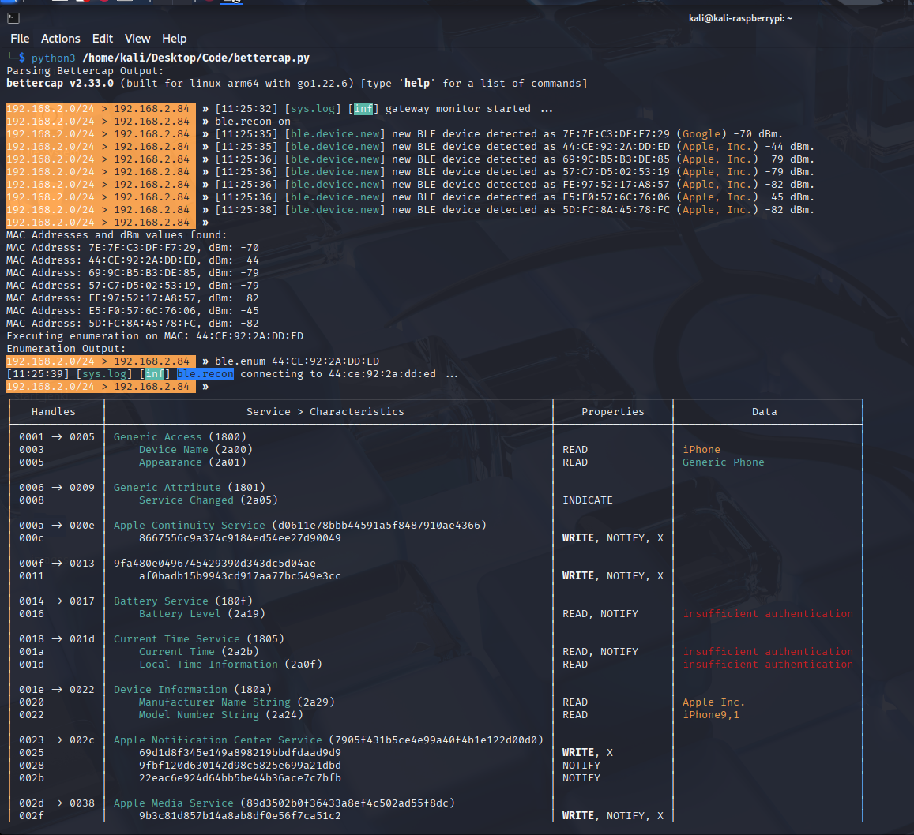
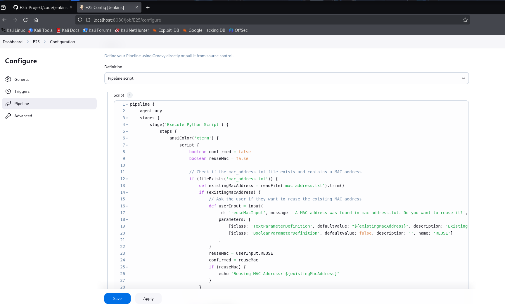
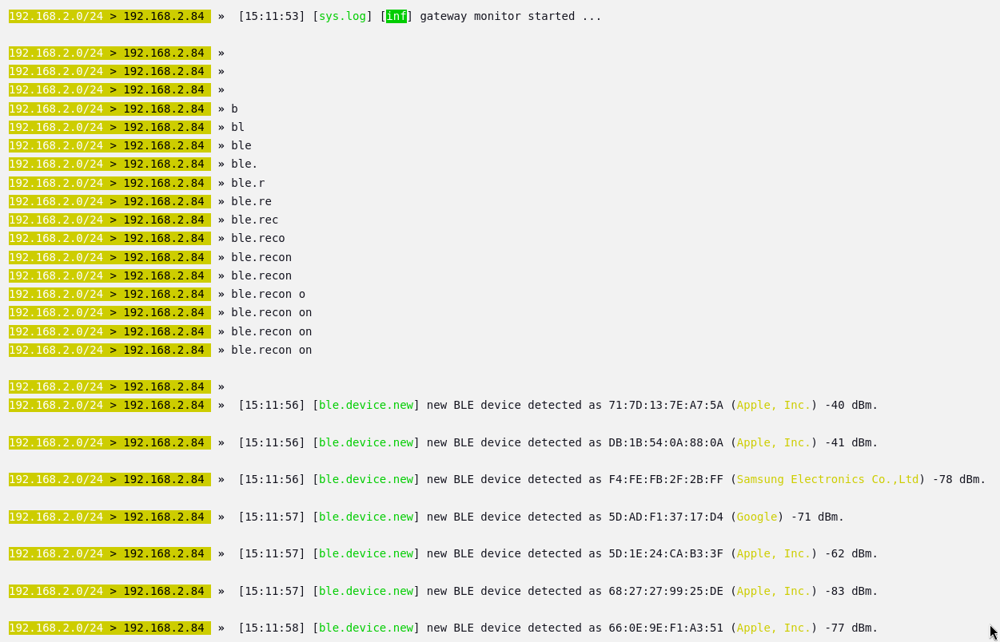
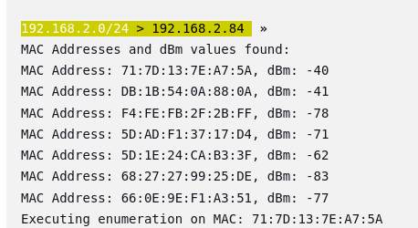
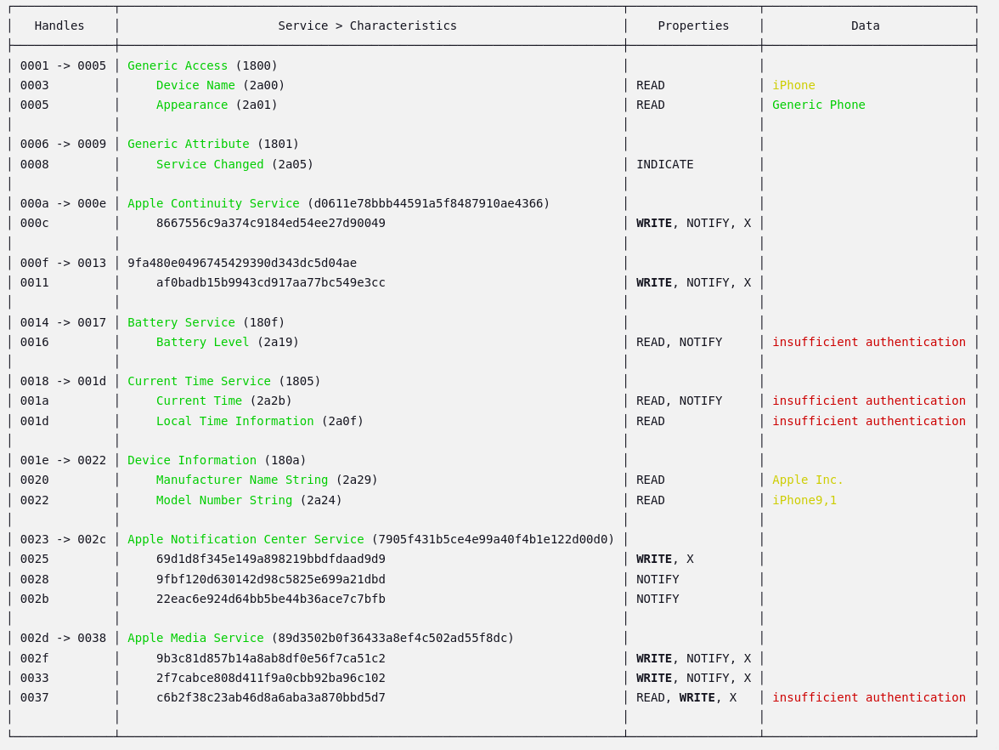
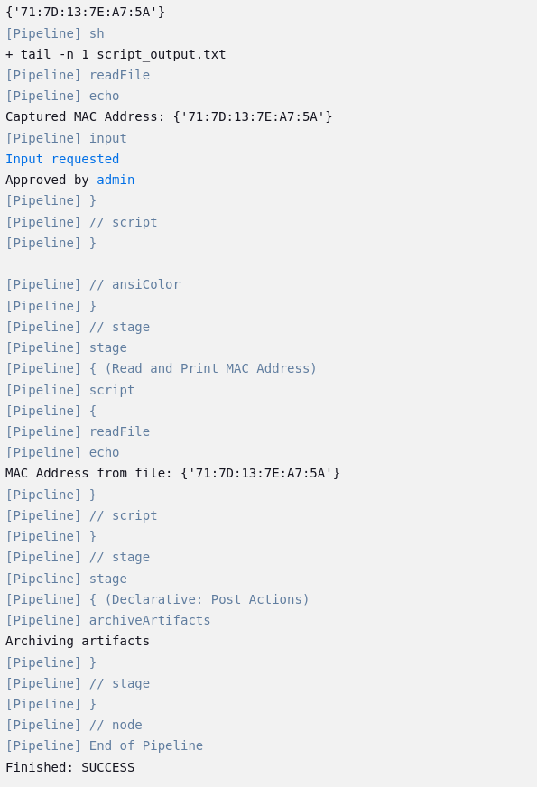
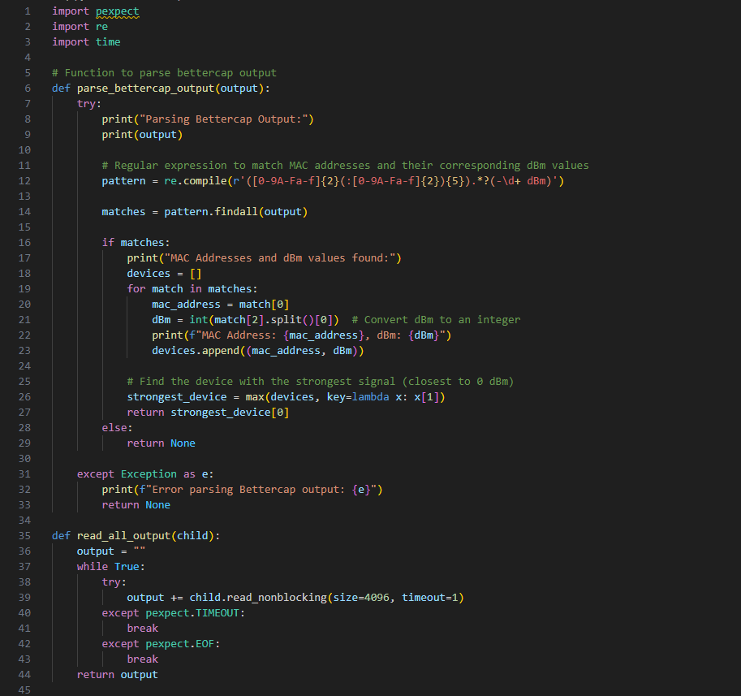
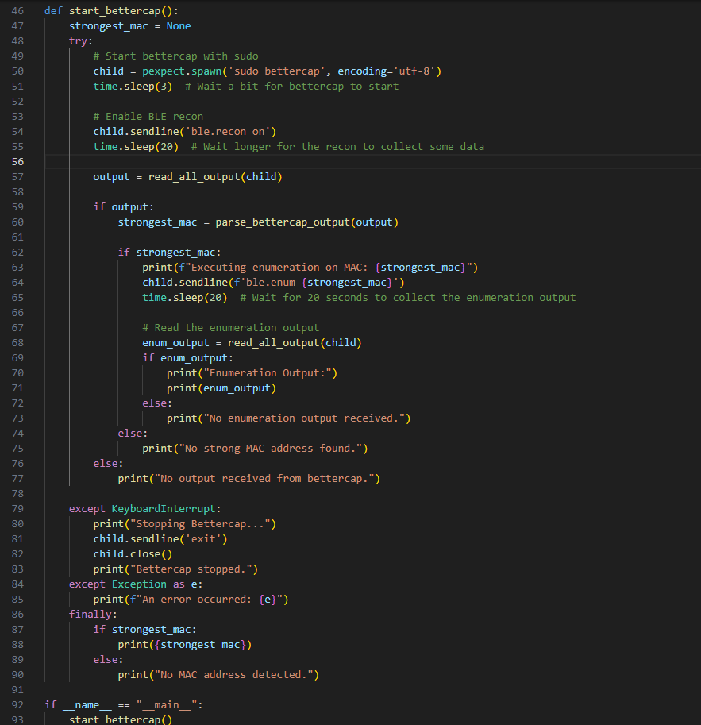
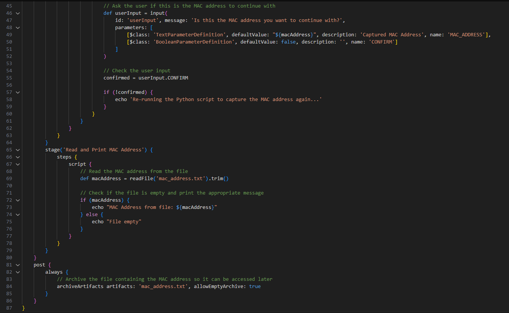

##CI/CD Bluetooth Recon Penetration Projekt
**OBS:** Koden og lidt forklaring til koden kan findes i bunden af siden.  

##Terminal Python Script  
  
Efter at lave skriptet med mange forsøg for at få det hele til at fungere specielt med en regular expression,  
kan scriptet starte Bettercap og en ble recon for a kigge efter devices og deres mac addresse samt signal styrken og hvilken form for enhed det er.
Som set på billedet over så kan jeg se en masse apple produkter (højst sansyneligt iphones) der efter vil den liste dem alle ud som den har opsnappet  
og så vælge den med den stærkeste signal styrke da det er højest success at enumerate til som den så vil enumerate til og derefter poste hvad information den får ved at "connect" til den.  
Det der er vigtigt at forstå er at brugeren på den device som den connecter til VIL IKKE få at vide at de er blevet enumerated da det som den gør er at spørge efter dens GATT profil (Generic Attribute Table), som er  
hvor den basically spørger om ALT som den device har til rådighed. Derefter vil vi disconnect for ikke at vække noget suspicon og så får vi en masse information som KAN blive bruge til exploitations hvis man er en  
trusselaktør, f.eks. denne telefon som vi connecter til (min mors telefon som jeg fik lov til at bruge til min fremvisning) har WRITE og NOTIFY og READ properties som tillader os at gøre nogen ting gennem bettercap som man kan passe på med, da vi kan write og notify til "Apple Notification Center Service" hvor vi kan sende falske notifikationer måske endda med harmlig kode hvis de trykker på notifikationen, som kan blive brugt med  
apps til at lave phishing attacks eller andet. Derudover med mac addresserne hvis en f.eks er ved at pair med en anden device kan vi lave en MITM attack. Derved at at samle disse mac addresser meget vigtigt. I mit projekt har jeg holdt mig til mere at lære hvordan man kan bruge bettercap med CI/CD så jeg har ikke haft tid til at lære hvordan jeg kunne lave en MITM attack men mere at det er muligt.   

##Config Jenkins
  
Efter at en et python script der virker sætter vi op en jenkins pipeline og configurer det med et CI/CD script som bruger stages til at gøre ting i forskellige rækkefølger.  
I mit projekt har jeg sat op 2 stages for at fremvise hvordan det fungerer hvor at vi har et stage som kører koden og bruger den information som scriptet giver, og selv inde i dette script kan vi køre kode som gør at stagen kan køre igen og igen indtil vi får hvad vi leder efter og gemmer den information som vi vil bruge hvis vi havde flere scripts til exploits vi kunne bruge den device vi har fundet til at teste for en masse kendte exploits. Og i anden stage confirmer vi at den device vi har sagt er god til at teste for exploits er gemt til fremtidig brug, dette ville betyde mere i en test suite environment for et firma som gerne ville pent teste deres devices eller hobby cybersikkerhed arbejdere som er intereseret i at teste deres egne devices. (Bettercap can bruge både bluetooth og wifi og mere).

##Pipeline Recon
  
Efter at sætte op vores jenkins script kører vi builded hvor den vil først kigge om vi har en eksisterende mac addresse vi vil bruge for at skippe denne stage, men da vi ikke har vil den starte python scriptet med at søge efter devices som set på billedet over.

##Pipeline Mac Found
  
I billedet over opfanger den så de mac addresser som vi leder efter og den fanger derved alle og derefter vælger den med den stærkeste styrke.

##Pipeline Enum
  
  
Derefter at enumarate og vi får success ser vi det samme som i python scriptet som er en god til at vi kan se at scriptet fungere i vores ci/cd pipeline

##Pipeline Sucess
  
Derefter vil den give os et input requirement i vores pipeline script til at spørge om vi er sikker på at vi vil bruge denne device, hvis ja vil den blive gemt hvis ikke vil den prøve at kører scriptet igen for at fange en anden device ellers kan vi også bare abandon builded, i dette tilfælde siger vi ja hvor den så slutter det første stage og starter den anden stage som bare printer ud den mac addresse som vi har sagt er vores som beviser at vi har gemt og kan bruge den til flere exploitive scripts og forsøg helle i en CI/CD pipeline environment for pent testing.

##Bettercap Python Kode  
  
  
🔹pexpect bruges til at starte og styre eksterne programmer (som fx bettercap) automatisk som om du selv skrev i terminalen.  
🔹re er til regulære udtryk, så vi kan søge efter bestemte tekstmønstre, f.eks. MAC-adresser og signalstyrker.
🔹time bruges bare til at lave pauser (sleep), så vi giver tid til, at programmer når at levere output.

Funktion: parse_bettercap_output(output)  
🔹Denne funktion tager tekst-output fra bettercap og forsøger at finde MAC-adresser og deres dBm (signalstyrke).  
🔹Den printer først outputtet, så vi kan se, hvad der faktisk bliver forsøgt parset.  
Derefter defineres en regex der leder efter:  
🔹En MAC-adresse (f.eks. AA:BB:CC:DD:EE:FF)  
🔹Noget "løst tekst"  
🔹En dBm-værdi (f.eks. -65 dBm)  
For hvert match:  
🔹MAC-adressen og dBm signalstyrken hives ud.  
🔹dBm-værdien konverteres fra tekst til et heltal (fordi vi vil kunne sammenligne dem numerisk).  
🔹Alle fundne enheder gemmes i en liste som (mac, dBm).  w
Til sidst vælges den MAC med stærkest signal (tættest på 0), dvs. højeste dBm-værdi. 

Funktion: read_all_output(child)
🔹Denne funktion forsøger at læse alt output fra bettercap processen.
🔹Den bliver ved at læse små bidder indtil der ikke kommer mere output.
🔹Hvis der sker timeout eller processens output lukker (EOF), så stopper den og returnerer det samlede output.

Funktion: start_bettercap()
🔹Starter en ny bettercap-proces som root (sudo bettercap) med pexpect.
🔹Venter 3 sekunder på at programmet starter op.
🔹Sender kommandoen ble.recon on, hvilket starter scanning af Bluetooth Low Energy (BLE) enheder.
🔹Venter 20 sekunder for at samle data.
🔹Bruger read_all_output til at hive alt output fra processen.
Hvis der blev fundet noget:
🔹Parser outputtet med parse_bettercap_output.
🔹Hvis der blev fundet en stærk MAC-adresse:
🔹Kører en ble.enum {MAC} kommando for at hente flere detaljer om den specifikke enhed.
🔹Venter igen 20 sekunder og læser alt nyt output.
Hvis der trykkes Ctrl+C (KeyboardInterrupt), så sender den exit til bettercap og lukker processen pænt.
🔹Ved fejl fanges det og printes.
🔹Når scriptet er færdigt, fortæller det om der blev fundet en MAC-adresse eller ej.

##Jenkins Groovy Kode  
  
  
pipeline beskriver hele Jenkins job'et.  
🔹agent any betyder, at den kan køre på hvilken som helst tilgængelig agent (node).  
🔹stages indeholder trinnene for hvad der skal ske.  
🔹post beskriver hvad der altid skal gøres efter builden (her: gemme artefakter).  

Stage: 'Execute Python Script'  
🔹ansiColor('xterm') bruges for at farverne i Jenkins Console Output bliver pæne.  
🔹script { ... } gør, at man kan skrive almindelig Groovy kode.  
Inde i script:  
🔹Starter med at sætte to boolean flags: confirmed og reuseMac, som bruges til styring af flowet.  
🔹Tjek for eksisterende MAC adresse:  
🔹Ser om mac_address.txt filen findes og har indhold.  
🔹Hvis ja, spørger brugeren via Jenkins GUI om de vil genbruge den eksisterende MAC adresse.  
🔹Hvis brugeren siger ja (REUSE bliver true), sætter vi confirmed = true, så vi springer over at køre scriptet igen.  
Hvis ikke bekræftet: kør en loop:  
🔹Printer besked om at Python script køres.  
🔹Kører Python scriptet (bettercap.py) og gemmer alt output i script_output.txt.  
🔹Trækker sidste linje ud fra script_output.txt (forventer det er MAC-adressen) og gemmer i mac_address.txt.  
🔹Læser den nye MAC-adresse og viser den i konsollen.  
🔹Spørger brugeren igen via input i GUI, om den fundne MAC-adresse er godkendt.  
🔹Hvis ikke godkendt (CONFIRM == false), så kører scriptet forfra i loopen.  
🔹Dette loop fortsætter indtil brugeren accepterer en MAC-adresse.  

Stage: 'Read and Print MAC Address'  
🔹Simpelt trin.  
🔹Læser mac_address.txt igen.  
🔹Hvis filen indeholder noget: printer MAC-adressen.  
🔹Hvis filen er tom: printer besked om det.  

Post: always  
🔹Efter alle stages (uanset om det fejler eller lykkes), arkiveres mac_address.txt som en artefakt.  
🔹Så kan man hente filen senere fra Jenkins UI.  

##Samlet Flow Visualisering  
Start pipeline  
    |  
    v  
Tjek om der findes en MAC-adresse fra før  
    |  
    +--> Ja: Spørg om vi vil genbruge den  
    |  
    v  
Hvis ikke genbruge -> Loop:  
  🔹 Kør Python script  
  🔹 Gem ny MAC  
  🔹 Spørg om MAC er ok  
  🔹 Hvis nej, gentag  
  🔹 Hvis ja, fortsæt  
    |  
    v  
Læs og print MAC-adresse  
    |  
    v  
Arkiver mac_address.txt  

