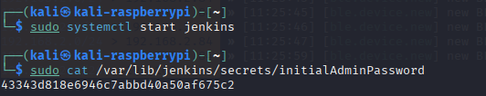
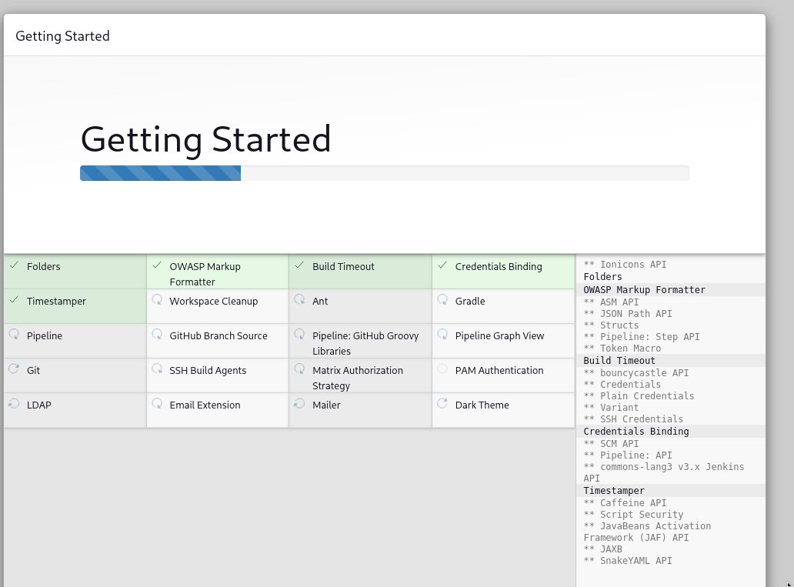
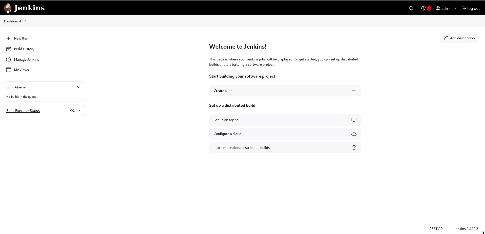
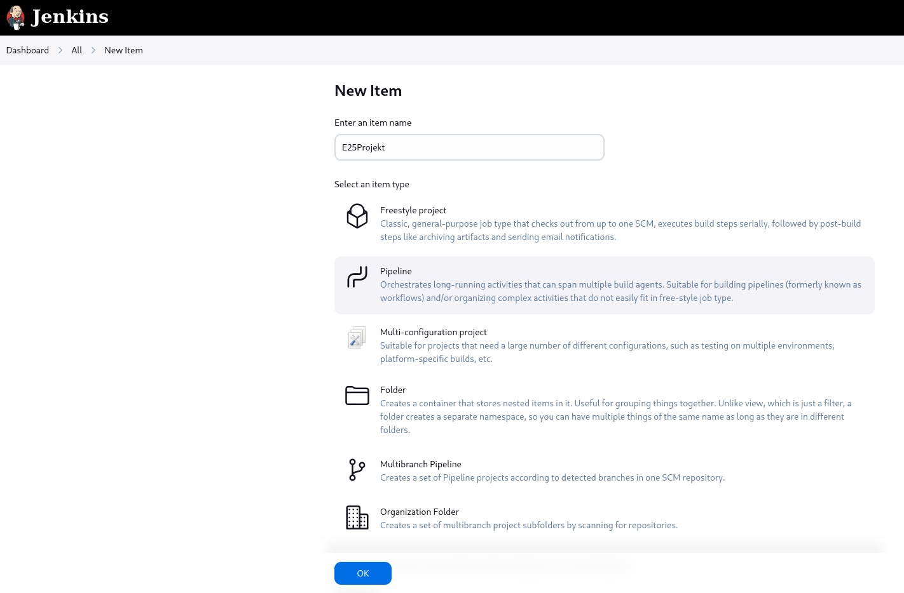

##Værktøjer som jeg har brugt

##RaspberriPi 5 Model B 1.1
RaspberriPi er blevet brugt til projektet da det er nemt at bære rundt på da jeg har brugt den både ved min lejlighed og mine forældre samt den er udstyrret med alt nødvendigt grej såsom bluetooth (BLE).  

##Kali Linux
Kali Linux er mit valgte OS da den er perfekt for cybersikkerhed og er tit downloaded med alle de værktøjer man tit bruger, derudover da den er bygget på ubuntu er den god da den understøtter stortset alt ubunt gør, og den kom pre-installed med Bettercap og en nem GUI at bruge.

##Bettercap
Bettercap er et kraftfuldt hacking- og overvågningsværktøj.  
Det bruges til at man-in-the-middle (MITM) angreb, fange data, manipulere netværkstrafik, sniffe adgangskoder, spoofe enheder, angribe Bluetooth, angribe Wi-Fi og meget mere.  
Det kan tænkes lidt som en "Swiss Army Knife" eller Jack of all trades for netværkshacking. 

I mit tilfælde har jeg brugt:

ble.recon:  
Bruges til at opdage Bluetooth-enheder omkring dig, før du angriber eller efterligner dem.  

ble.enum:  
Bruges til at kortlægge enhedens funktioner (fx "kan vi sende data til den?" eller "kan vi modtage fake notifikationer?").  

Derudover hvis jeg havde mere tid til flere scripts ville der kunne blive brugt: 

ble.write:  
Bruges til at skrive data til en Bluetooth Low Energy (BLE) enhed, kan f.eks. sende kommandoer, ændre indstillinger, eller snyde enheden til at gøre noget.

arp.spoof:  
Bruges til at aflytte eller ændre trafik på et LAN/WiFi netværk.  

arp.ban:  
Bruges til at smide folk offline (DoS - Denial of Service).

##Jenkins Pipeline
Jenkins Pipeline er mit valgte CI/CD program og kan køre scripts og kommandoer automatisk efter mit valg.  
CI/CD (Continous Intergration og Continuous Delivery/Deployment), gør at hver gang man trykker 'save' på sin kode, kan det automatisk blive testet og pipeline gør at man kan have en ci/cd som kan gøre flere ting en efter en anden automatisk.

  
I starten når vi starter vores jenkins skal vi bruge en secret admin kode til at logge ind for at lave en bruger første gang som den gemmer i en gemt fil på den pc man har sat jenkins op på. Derudover vil den også sige at vores Jenkins kører på port 8080 så vi kan gå ind på en browser og sætte i linket "localhost:8080"

  
Efter at have logget ind vælger man hvilke plugins den skal downloade og valgte bare at downloade de nødvendige.

  
Derefter er vi på Dashboarded hvor vi kan så lave en ny item

  
Derefter vælger vi en pipeline og sætter den op og configurere med den kode vi vil lave bagefter som set i Projektet.  
Jenkins Pipeline bruger et andet kodningsprog og har under projektet skulle lære om Groovy Syntax som er det sprog som de bruger som er baseret på sproget Java.  
Scripts som der bliver kørt gennem jenkins scriptet (groovy scriptet) er python scriptet og var derfor ikke så svært i forhold til alt den tid jeg skulle bruge til at lære et nyt sprog.  

